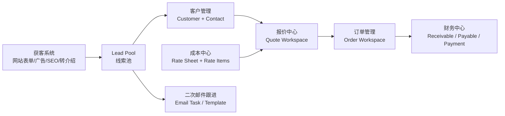

# 当前系统框架与业务逻辑

## 1. 当前定位

这个项目现在不是单纯官网，而是一个物流业务系统 MVP。核心目标是把获客、客户、报价、订单、成本中心、财务核算串成一条可操作链路。

当前业务聚焦已调整为中欧、中亚、中俄及欧亚大陆陆路通道，优先覆盖班列拼箱 LCL、班列整柜 FCL 和卡车门到门/末端派送业务。业务范围、线路信息来源、产品映射和登录权限分类已整理到 `docs/EURASIA_BUSINESS_SCOPE_AND_PERMISSIONS.md`。

当前技术框架：

- 前端：Vite + React + Tailwind CSS
- 数据层：Supabase Database + Auth + RLS
- 状态/请求：React Query
- 本地兜底：未配置 Supabase 时，页面仍可用 mock/demo 数据演示
- 经营驾驶舱：通过 RPC `app_dashboard_summary` 汇总当前账号可见的线索、报价、订单、毛利和待办；未登录或权限不足时明确显示演示数据
- 总览页已补“今日增长指挥台”，会把线索首响/二次触达、低毛利报价、订单待成本和待收款自动排成 P1/P2/P3 跨模块动作，负责人可一键复制增长作战清单，或点击动作直接跳转到线索、报价、订单、财务工作台处理。
- 总览页已补“传统系统借鉴雷达”，会对照成熟 CRM、客户管理、供应商管理 / SRM、TMS 和 ERP / 财务系统，把当前项目已借鉴能力、实时业务信号和下一步优化动作集中展示；点击来源系统可直接跳转对应工作台。

## 2. 模块结构

获客模块现在不只是存线索，还支持实用的自动化：

- 官网首页提供快速询盘表单，`/quote` 公开报价页也会把访客提交写入 `leads`；公开入口会采集公司、联系人、邮箱或 WhatsApp/电话、起运地、目的地、货物体积/重量、服务范围、预计发货时间和偏好联系方式，减少只有姓名邮箱的低质量线索。
- 所有公开页面底部已补 30 秒迷你询盘，访客无需跳转即可提交姓名/公司、邮箱或 WhatsApp、起运地、目的地和货物；线路页与带参数的报价页会自动带入当前线路，提交后直接进入线索池并保留页面与营销归因。
- 公开页面现会把同一会话、同一路径的首次访问写入 `website_visits`，React Strict Mode、刷新或重复进入不会在同一会话内重复计数；访客提交询盘时复用该访问 UUID，让 `leads.website_visit_id` 直接关联真实访问。
- 首页快速询盘、`/quote` 公开报价页和线路落地页都已补邮件兜底与复制询盘详情能力；当浏览器剪贴板或 Supabase 写入失败时，页面会保留客户已填内容，生成可直接发送到 `Benjamin@eurasiago.com` 的邮件草稿/文本，减少高意向访客因为接口异常或权限问题流失。
- 首页快速询盘、`/quote` 公开报价页和线路落地页会自动保存未提交草稿到访客浏览器本地；刷新、跳页或回访后会恢复已填写内容并提示“草稿已恢复”，也提供“清除草稿”入口供客户重新填写，提交成功后自动清除草稿，减少客户重复填写和中途流失。
- 首页和公开报价页会按联系方式完整度、路线完整度、货物信息、发货窗口和服务范围预估 `lead_score`、`intent_level`，并把路线、发货窗口、服务范围、偏好联系方式写入 `message`，让销售打开线索后能直接首呼/首封邮件。
- 公开报价页右侧展示的是非正式快速估算和下一步确认说明，不再把原型价格伪装成正式报价，避免客户误解，也把提交按钮改为请求正式报价。
- 公开站点已补 SEO 获客基础：`index.html` 有更完整的 title、description、keywords、canonical、Open Graph、Twitter Card、hreflang 和 JSON-LD；`robots.txt` 与 `sitemap.xml` 会引导搜索引擎收录首页、报价页和关于页，并避开内部系统页。
- React 路由会按首页、报价页、关于页、系统页动态更新浏览器 title、description、canonical 和社媒分享 meta；系统页设置 `noindex`，避免内部工作台被搜索引擎收录。
- 首页正文已补热门中欧铁路线路和常见问题区块，覆盖 Xi'an/Chengdu/Chongqing/Yiwu/Shenzhen/Guangzhou 到 Duisburg/Warsaw/Hamburg/Paris/Milan 等搜索词，并解释时效、清关派送、小货拼箱和正式报价边界，提升自然搜索承接和访客决策效率。
- 公开站点已新增独立线路/服务落地页 `/routes/xian-chengdu-chongqing-to-duisburg`、`/routes/yiwu-shenzhen-guangzhou-to-warsaw`、`/routes/zhengzhou-wuhan-to-hamburg-paris-milan`、`/routes/china-to-amazon-fba-germany-rail-ddp`、`/routes/china-to-europe-ddp-rail-door-delivery`、`/routes/shenzhen-guangzhou-to-germany-door-delivery`、`/routes/china-to-poland-warehouse-rail-freight`、`/routes/china-to-kazakhstan-central-asia-rail-truck`、`/routes/china-to-russia-rail-truck-door-delivery`、`/routes/eurasia-continental-truck-freight`，每个页面有独立 SEO title、description、canonical、线路卖点、适配货物和带参报价 CTA；首页热门线路卡片会进入线路页或直接进入预填报价页，`sitemap.xml` 已收录这些长尾获客页面，并补了 Netlify `_redirects` 与 Vercel `rewrites`，降低静态部署下直接访问深链接 404 的风险。
- 公网页面已补固定底部转化条 `PublicConversionBar`，首页、线路目录、线路详情和报价页都会显示 `Get firm quote / Email sales / Copy brief` 低门槛入口；线路详情会自动带当前线路上下文跳转预填报价页，邮件和复制兜底会保留页面来源、线路、服务范围和待补字段，减少访客没填完整表单就离开的流失。
- 公开站点已新增 `/routes` 线路/服务目录页，集中展示所有中欧铁路、DDP、FBA、德国门到门和波兰仓长尾页；导航栏和 `sitemap.xml` 已接入，目录页会给每条线路提供“查看线路页”和“预填报价”双 CTA，并注入 `ItemList` JSON-LD，承接更泛的路线搜索词和站内浏览流量。
- `/routes` 目录页已补“路线推荐快速询盘”表单，适合不知道该选哪条线路的访客；表单会采集起运地、目的地、货物、服务需求和联系方式，按完整度预估 `lead_score`/`intent_level`，用 `route_index_recommendation_form` 归因写入线索池，并复用本地草稿、邮件兜底和复制详情能力。
- 线路/服务落地页已补可见 FAQ 和动态 JSON-LD 结构化数据，会按页面数据生成 `Service`、`FAQPage` 和 `BreadcrumbList`，让搜索引擎更清楚每个长尾页的服务范围、常见问题和站内层级，也让访客在提交询盘前先解决时效、货物适配、清关派送和报价资料问题。
- 项目已补 `npm run check:routes` 获客页面一致性检查，会校验 `routeLandingPages` 里的每个 slug 是否同时出现在首页热门线路入口和 `sitemap.xml`，并检查 SEO/CTA 必填字段，避免新增长尾页后忘记入口或收录配置。
- 每个线路落地页内嵌轻量询盘表单，访客不离开页面就能提交姓名、公司、邮箱或 WhatsApp、货物、体积重量和发货窗口；表单会按路线页场景预估 `lead_score`、`intent_level`，写入 `Selected lane`、`Route page`、时效和服务范围，并用 `route_landing_form:{slug}` 记录触点，减少从 SEO 页面跳转报价页时的流失。
- 线路落地页已补邮件兜底：客户可直接打开带路线、服务范围、货物和联系方式的邮件草稿，或复制询盘详情；如果数据库表单提交失败，页面会保留完整询盘文本并提示直接发送到 `Benjamin@eurasiago.com`，避免高意向 SEO 流量因接口异常流失。
- 热门线路卡片可直接跳转到 `/quote` 并预填起运地、目的地、LCL 和门到门服务范围，报价页会显示预填线路提示、允许清除路线，并把 `Selected lane` 写入线索 `message`，减少重复输入并让销售知道客户点击的是哪条线路。
- 公网获客入口会采集并持久化 `utm_source`、`utm_medium`、`utm_campaign`、`utm_term`、`utm_content`、click id、referrer、首次落地页、提交页面、visitor/session 和设备类型；访客从广告/SEO/转介绍进入首页后再跳转到 `/quote` 提交，仍会保留首次/最近触点归因。
- 提交线索时会按持久化 UTM 自动匹配 `campaigns` 和 `lead_sources`，先写入 `website_visits`，再把 `website_visit_id`、`campaign_id`、`lead_source_id`、来源类型和渠道细节带入 `leads`。
- 营销获客页顶部已改成实际待办工作台，直接聚合待首次跟进、高意向未报价、疑似重复和待发邮件队列；点击卡片会过滤/聚焦线索或切换邮件任务，而不是展示模块介绍。
- 营销获客页已补“未分配线索”队列和一键认领能力，列表与线索详情都能把 `assigned_to` 写成当前登录账号；未登录或本地草稿会只做本地标记并明确提示，避免新询盘进入系统后无人负责。
- 营销获客页已补跟进 SLA 队列，会按 `created_at`、`first_response_at`、`last_follow_up_at`、评分和意向自动标记“首响超时 / 跟进超时 / 今日到期 / 正常”，顶部“跟进到期”卡片可直接聚焦最紧急线索，列表和详情卡同步显示 SLA，帮助销售每天先处理最容易流失的客户。
- 营销获客页顶部已补“复制今日清单”，会把 SLA 到期/超时、未分配、高意向未报价和待首次跟进线索去重后按优先级整理成可粘贴文本，包含联系人、路线、货物、评分、负责人、推荐渠道和下一步动作，方便销售直接发到飞书/微信/邮件或作为日报执行清单；若浏览器禁用剪贴板，页面会展开清单预览框供手动复制。
- 线索详情侧边栏已接入真实处理动作和跟进时间线，可手工记录电话、WhatsApp、邮件或备注，标记已联系、进入培育、标记丢失、刷新评分、生成跟进邮件、转客户和创建报价；真实状态更新成功后会同步 `leads`、写入 `activities` 跟进记录，并在页面展示最近跟进历史。
- 线索详情已补“下一步行动卡”，按评分/意向给出 4 小时、24 小时或 3 天培育 SLA，自动推荐 WhatsApp/电话、邮件或补联系方式，并支持一键复制首触话术、打开 WhatsApp、打开邮件草稿、复制行动简报或套用到跟进记录表单，减少销售打开线索后的判断、写话术和录入成本。
- 二次邮件跟进不再只是展示队列；`email_tasks` 标记已发送、客户已回复、取消时，会同步沉淀到对应线索的 `activities` 时间线，并尽量更新线索最近跟进时间和首次响应状态。
- 营销获客页已补 campaign 成效看板，用 `lead_sources`、`campaigns` 和线索状态计算线索量、高意向、已报价、报价率、CPL 和渠道建议。
- Campaign 看板已补渠道行动计划，会按 P1/P2/P3 给出“加投放大、优化承接、降本筛选、补量验证、持续观察”等具体动作，并支持一键复制行动计划或导出 CSV，包含预算、线索、高意向、报价率、CPL、UTM 和下一步测试建议，方便投放和销售周复盘。
- Campaign 与路线成效面板会读取近 90 天新埋点访问，展示页面访问、独立会话、询盘和访问→询盘转化率；分析线索单独读取近 90 天最多 500 条，不再用业务列表第一页代替完整分析样本。行动建议会区分“没有流量”和“有流量但低转化”。
- Campaign 看板内置 UTM 获客链接生成器，可选择落地页、来源、媒介、活动名、关键词和内容标签，一键复制 `/quote` 等可追踪链接；也可以从已有 campaign 行直接套用参数，减少广告、邮件、WhatsApp、LinkedIn 和合作伙伴推广时手工拼错 UTM。
- 营销获客页已补“路线 / 落地页成效面板”，会按 SEO 路线页、报价页、首页或起运地-目的地聚合线索，展示线索量、高意向、待首响、SLA 超时、已报价和报价率，并给出“先救首响、补报价承接、加码复制、积累样本、补归因”等 P1/P2/P3 动作；面板支持复制路线行动计划和一键聚焦对应线索，UTM 生成器也已加入 `/routes` 与所有线路页选项，方便把有效路线直接复制到广告、SEO 内容或合作伙伴推广中。
- 营销获客页已补线索查重提醒，按邮箱、电话和公司名称相似度标记疑似重复，避免销售重复跟进。
- 营销获客页已补二次邮件任务工作台，可读取 `email_tasks`，按待发送/已发送/已回复筛选，支持打开邮件草稿或复制主题/正文；只有业务员真实发送后才标记已发送、客户已回复或取消。
- `app_score_lead` 按联系方式、路线完整度、货量、运输方式、来源和询盘文本计算 `lead_score`、`intent_level`、`next_best_action`。
- `app_schedule_follow_up_for_lead` 给单个线索生成二次邮件任务，并写入模板、主题快照、正文快照、优先级和计划发送时间。
- `app_bulk_schedule_lead_followups` 批量给新线索/已联系/培育中线索排邮件任务，避免销售漏跟。
- 新线索入库后触发器 `trg_auto_prepare_new_lead` 会自动调用评分逻辑，并在有邮箱和模板可用时创建 `auto_new_lead` 类型的待发送邮件任务；线索仍保持原状态，避免把“已排期”误认为“已联系”。

## 3. 客户管理逻辑

客户管理现在不再只是从线索带入后的详情页，而是基础 CRM 工作台：

- 客户页有客户列表、搜索、状态筛选、新增客户和从线索转客户入口。
- 客户快照支持编辑公司资料、英文名、客户类型、行业、国家城市、地址、网站、税号、来源、状态和主联系人。
- 系统按成交状态、报价/订单记录给客户做 A/B/C 分层，并提示下一步复购或唤醒动作。
- 客户页已补“客户复购 / 唤醒指挥台”，会按客户状态和最近更新时间自动聚合沉睡客户、停滞潜客、14 天未互动成交客户和资料缺口，给出 P1/P2/P3 联系建议；销售可复制客户增长清单、聚焦客户，或直接安排真实 `activities` 复购跟进记录。
- 客户页已补“客户去重 / 合并候选”，借鉴传统 CRM 主数据治理能力，按邮箱、电话、税号/VAT、规范化公司名、国家城市生成 P1/P2/P3 重复风险；系统只提示候选、聚焦客户和复制合并检查清单，不自动合并，避免报价、订单和财务余额被误归并。
- 客户快照已补“合同账期 / 合并审批 / 等级规则”，会按合同主体、合同地址、税号/VAT、账期/信用额度、合同/框架协议、疑似重复合并审批、客户等级/加价规则和财务主体生成商业治理分；销售可复制客户商业治理清单，避免未审客户进入正式报价、订单和开票。
- 客户资料缺口会直接提示联系人、邮箱、国家、行业、税号等缺失项，避免后续报价、订单和财务重复追资料。
- 客户可直接加入二次邮件/复购跟进，写入 `activities`；未登录或权限不足时先本地暂存。
- 客户列表原来的“跟进”提示按钮已改成真实排期动作，会选择该客户并写入复购/二次邮件活动；写库失败时保留本地活动，避免销售以为已安排但数据库没有记录。
- 未登录时新增客户会保留在当前工作台，不会卡死流程；登录有权限后可写入 Supabase 客户库。

## 4. 报价逻辑

当前报价已补成可用链路：

1. 从线索进入报价页。
2. 如果线索还没有客户档案，保存报价时会自动创建客户和联系人。
3. 点击重新核价时，调用 RPC `app_recalculate_quote_pricing`，由数据库统一匹配费率和计算报价。
4. RPC 按运输方式、货型、起运地、目的地、费率有效期和优先级选择费率表，并按费率行计算成本。
5. 系统按最低毛利目标反推收入，计算费用、成本、收入、利润和毛利率。
6. 保存报价写入：
   - `quotes`
   - `quote_items`
7. 报价保存后可以继续生成客户版邮件、打印/保存 PDF、标记发送、提交审批或转订单。
8. 客户版报价输出只展示收入价格、路线、货物、有效期和条款，不暴露内部成本、利润和毛利率。
9. 如果 Supabase 未配置或未登录，系统会保留本地报价草稿和状态，便于演示，但不会写入数据库。

之前不能真实报价的主要原因：

- 报价保存依赖 `customer_id`，但普通线索进入报价时还不是客户。
- 核价接口只调用 `/api/v1/pricing/recalculate`，但项目没有后端服务。
- 保存失败后页面只提示本地保存，没有保留可继续转订单的本地报价对象。

现在已修复：

- 报价 API 可以自动建客户。
- 核价 API 已迁入 Supabase RPC，避免浏览器端自行决定报价规则。
- 核价结果会提示路线弱匹配、费率有效期缺失、多币种和低毛利审批风险。
- 本地报价草稿也能继续转成本地订单草稿。
- 报价页的“发送报价草稿”和“提交审批”已接入状态更新，不再是空按钮。
- 报价页已支持复制客户邮件正文，以及通过浏览器打印窗口保存客户版报价 PDF；真实报价状态更新失败时不会再把数据库报价伪装成本地已发送或待审批。
- 报价中心已补“报价跟进工作台”，会把当前报价预览/草稿和最近真实报价合成一个销售队列，统计草稿待发、待审批/低毛利、已发待追和可转订单，并按 P1/P2 给出“审批低毛利、今天发出、追客户回复、转订单、复盘报价”等动作；销售可一键复制报价行动清单，同步给销售、主管或操作团队，避免线索已报价后没人跟、低毛利报价无人审或已接受报价未及时转订单。
- 报价中心已补“报价版本 / 正式输出”，会按客户、路线、运输方式和货物组成识别同组报价版本，检查报价编号、有效期、低毛利审批、草稿/已发送/已接受状态、客户版邮件/PDF 和转单准备度，并生成 P1/P2/P3 正式输出清单，避免旧版本发给客户或已接受报价未转订单。
- 报价治理已补 Supabase 生产链路：`quote_versions` 锁定报价版本快照，`quote_approval_events` 记录发送/提交审批/批准/拒绝/正式输出审计，`quote_output_documents` 记录客户版邮件/PDF 输出归档；前端发送报价、提交审批、复制邮件和打印 PDF 会调用 `app_record_quote_governance_event` 写入这些证据。

## 5. 订单逻辑

当前订单已支持两条路径：

1. 报价转订单：
   - 保存报价后点击 `Convert to Order`
   - 调用 RPC `app_convert_quote_to_order`
   - 写入 `orders`

2. 手工录订单：
   - 进入订单模块
   - 填客户、联系人、订舱号、箱型/箱量、贸易条款、运输方式、货型、路线、货物、包装、件数、体积、重量、币种、收入、成本和操作负责人
   - 点击 `Save Order`
   - 如果没有客户，会自动创建客户
   - 写入 `orders`
   - 保存前会校验客户、起运地、目的地和货物描述，收入、成本、体积、重量、件数不能为负数，避免生成空订单或错误财务记录

之前不能录订单的主要原因：

- 订单页只有展示和财务按钮，没有保存订单表单。
- `ordersApi` 没有 `create` 方法。
- 订单表要求 `customer_id`，但手工录单场景没有客户自动创建逻辑。

现在已修复：

- 新增订单保存 API。
- 新增订单页手工录单表单，并补齐箱型/箱量、贸易条款、包装、件数、币种、操作负责人等真实订单字段。
- 新增订单列表入口，搜索、状态、运输方式、货型和日期筛选会直接刷新订单查询；业务入口和保存视图不再只是展示标签。
- 新增 `useCreateOrder` hook。
- 没有客户时可自动创建客户再写订单。
- 新订单会初始化订单详情明细：任务流程、货物明细、服务段、费用行、操作日志。
- 订单详情 API 会读取 `order_parties`、`order_cargo_items`、`order_service_segments`、`order_task_items`、`order_documents`、`order_finance_lines`、`order_exceptions`、`order_operation_logs`，支撑概况、基本信息、单证附件、费用明细四个页签。
- 订单列表通过 `order_list_view` 读取，视图使用 `security_invoker` 继承底层 RLS，列表可稳定显示客户名称、报价单号、应收/应付汇总，并支持搜索订单号、订舱号、客户名、报价号、起运地、目的地、运输方式、货型、订单状态和日期范围筛选。
- 订单详情费用页不再回退到固定演示费用；真实订单优先展示 `order_finance_lines`，没有费用行时按当前订单收入/成本生成待生成预览，金额为 0 时显示待生成。
- 订单页“标记可执行”通过 RPC `app_update_order_status` 推进订单状态，在数据库事务里锁定订单、校验权限并写入操作日志；真实订单更新失败时不再改本地状态。
- 任务节点通过 RPC `app_update_order_task_status` 更新为进行中、完成或重新打开，在数据库事务里锁定任务和订单、校验权限并写入操作日志；真实任务更新失败时不再改本地状态。
- 订单列表页已补“订单执行指挥台”，会按当前可见订单自动聚合待分配负责人、待标记可执行、待报关、待放行和待生成财务队列，给出 P1/P2/P3 操作建议；操作团队可一键复制订单执行清单，或点击“聚焦订单”把订单号带入搜索框，减少报价转订单后无人负责、报关/放行卡住、费用未同步财务的问题。
- 订单详情页已补“订单详情治理 / 异常闭环”，会把门到门进度、附件准备、打开异常、任务阻塞、主数据、操作日志和财务交接统一评分，生成 P1/P2/P3 风险缺口和下一步动作；操作团队可复制详情治理清单，同步给客服、操作、海外代理和财务闭环。
- 订单详情页已补“客户轨迹 / 异常责任 / POD归档”，会按客户可视进度、分享入口、客户通知日志、异常责任/预计解决时间、签收回单/POD 和关键附件归档生成 P1/P2/P3 风险，避免客户查不到进度、异常无人负责或签收后无法回款。

## 6. 成本中心逻辑

成本中心目前由 Supabase 表支撑：

- `vendors`
- `rate_sheets`
- `rate_sheet_items`
- `quote_items`
- `quote_cost_snapshots`
- `order_costs`
- `payables`

前端已补 `成本中心` 模块，支持查看供应商、费率表、费率行，并可在有权限账号下新增费项。勾选 `参与自动报价` 的费项会被报价中心读取，用于自动核算成本、销售价和毛利。

成本中心已补“费率健康 / 补价指挥台”，会交叉检查费率状态、有效期、供应商、线路范围和当前费率表的自动报价费项，把已过期、7 天内到期或会阻断核价的问题列为 P1，把 30 天内到期、草稿和资料不完整列为 P2。采购或运营可复制补价行动清单，并从风险项直接聚焦对应费率表。

成本中心已补“费率版本 / 生效审批”，会按版本连续性、审批状态、生效窗口和自动报价费项生成准备度分数、P1/P2/P3 风险和审批清单；草稿、过期、无下一版、未绑定供应商或缺自动报价费项会提前阻断，避免未审批价格进入客户报价。

成本中心已补“供应商 KPI / 风险画像”，会把费率新鲜度、档案完整度、服务覆盖、财务准备和异常压力合成供应商 KPI 分数、等级和 P1/P2/P3 动作，帮助采购判断供应商是否适合作为自动报价和履约首选。

成本中心已补“供应商附件 / 响应 / 对账付款”，会按合同/框架协议、营业执照/注册号、银行账户、报价原件/费率附件、服务联系人、报价响应时效、对账争议和应付逾期生成供应商详情治理分，并支持复制详情治理清单，避免未审供应商进入客户报价或门到门履约。

当前自动报价逻辑采用成本价加成方式：

- 从 `rate_sheet_items.unit_price` 读取成本单价
- 根据计费方式计算数量：
  - `per_cbm` 按体积
  - `per_kg` 按重量
  - `per_container` 按箱
  - `fixed` 按票
- 暂按 22% 加成生成销售价
- 生成报价收入、成本、利润和毛利率

后续生产级要补：

- 不同客户等级加成规则
- 销售价和成本价分离
- 航线/港口更精确匹配
- 审批角色、审批人队列和拒绝/退回重报配置
- 币种和汇率
- PDF 文件上传到 Storage、邮件服务发送回执和版本详情页展示

## 7. 财务逻辑

报价转订单后，订单可以继续生成：

- 应收：`receivables`
- 应付：`payables`
- 成本记录：`order_costs`
- 收付款记录：`payments`
- 订单费用明细：`order_finance_lines`

`order_finance_lines` 是订单页可编辑的费用行，适合承接成熟系统里的应收/应付明细、费项、单价、数量、汇率、税率、账单号、发票号和推送用友状态。`receivables`、`payables` 仍作为财务主账和收付款核销对象。

当前已经把基础核销动作迁入数据库事务：

- 成本录入页已从固定占位按钮改为真实成本表单，可选择 `vendors` 里的供应商，填写费项代码、类别、说明、币种、含税金额、税率、发生日期、是否预估和状态，并写入 `order_costs`；未关联供应商的成本仍可用于毛利核算，但不会自动汇总生成应付。
- 应收队列通过 RPC `app_record_receivable_payment` 登记收款，在数据库事务中锁定应收行、校验金额/币种/重复流水，再写入 `payments` 并更新 `receivables`。
- 应付队列通过 RPC `app_record_payable_payment` 登记付款，在数据库事务中锁定应付行、校验金额/币种/重复流水，再写入 `payments` 并更新 `payables`。
- 财务结算页不再提供“一键收清/付清”的假动作；登记收款/付款前必须在表单里确认金额、币种、收付款日期、方式、银行/平台流水号，可选填写汇率和本位币金额，并由 RPC 继续执行防重复、防超付和币种校验。
- 财务页已把成本明细和应付结算拆开：`order_costs` 只用于成本和毛利核算，`payables` 才能登记付款，避免把成本行误当应付行核销。
- 真实单据写库失败时前端不会再扣减本地余额，只提示失败原因；只有明确标记为“本地草稿”的单据才允许本地模拟。
- 财务看板的未收应收、未付应付和预计利润会随本地/实时收付款状态更新，并标注数据来源。
- 财务结算页已补“财务结算指挥台”，会按当前财务包自动聚合逾期/到期应收、到期应付、预估成本、供应商缺失和低毛利/负毛利风险，给出 P1/P2/P3 处理建议；财务可一键复制行动清单，或点击“聚焦处理”直接打开收款/付款/成本处理入口。
- 财务结算页已补“对账 / 开票 / 核销准备度”，会按票据准备、账期准备、时效压力和毛利确认生成结算准备分、等级、风险原因和下一步动作，帮助财务先补会卡住客户对账、供应商付款或月末核销的项目。
- 财务结算页已补“发票税率 / 核销控制台”，会把应收/应付发票或账单号、成本税率、税额平衡、余额核销和账期控制合成 P1/P2/P3 风险，提前发现缺票、税额不平、余额未核销和逾期应收。
- 财务结算页已补“财务规则 / 外部导出控制台”，会按账期规则、汇率/本位币、坏账/折扣策略和外部系统导出字段生成导出治理分，提前发现长期逾期未设策略、外币缺汇率、草稿成本和 ERP/用友导出字段缺失。
- 财务治理已补 Supabase 生产链路：`financial_rules` 记录税率、汇率、核销、审批和导出映射规则；`finance_export_jobs` 记录 ERP/用友/金蝶/CSV 导出任务、状态、失败原因和重试时间；`finance_export_events` 记录 prepare/export/ack/fail/retry 审计事件；RPC `app_record_finance_export_event` 统一记录导出、回执和失败重试。
- 财务结算页已支持导出应收、应付或完整财务包 CSV，对账文件会带上单据类型、余额、状态、数据来源和导出时间，方便客户/供应商/内部财务核对。

当前财务是 MVP 可用链路，适合验证流程。正式上线前需要和财务确认：

- 发票号、税率/VAT、账期、坏账、折扣和汇兑损益的真实规则表
- ERP/用友/金蝶 API 对接、导出回执和失败重试
- 成本变更审批

## 8. 当前真实限制

目前系统要真实写库，必须满足：

1. `.env` 设置 `VITE_SUPABASE_URL` 和 `VITE_SUPABASE_ANON_KEY`
2. Supabase 已执行 `supabase/deploy_bundle.sql`
3. 已执行公网获客与 RPC 权限加固迁移
4. 用户已登录
5. 管理员在 Supabase `app_metadata.role` 或 `app_metadata.app_role` 分配角色

如果没有以上条件，页面仍能演示，但数据只会本地暂存。

当前远程 Supabase 项目 `hcorkkudgicarsmexnqf` 已部署当前 schema、seed、匿名获客写入策略和 RPC 权限加固，并通过 schema、Data API 和匿名 lead intake 检查。

## 9. 下一步优先级

1. 在现有 React Router 基础上，拆出订单、客户、报价详情页，例如 `/system/orders/:id`。
2. 建一个测试用户并设置 `app_metadata.role = "admin"` 或 `"sales"`。
3. 用真实账号跑完整链路：线索 -> 客户 -> 报价 -> 订单 -> 应收/应付。
4. 成本中心继续补 Excel 导入、真实费率审批流、供应商报价附件和审批审计。
5. 再补报价审批角色配置、订单详情独立页、正式 PDF Storage 归档、财务规则表和外部系统 API 对接。
