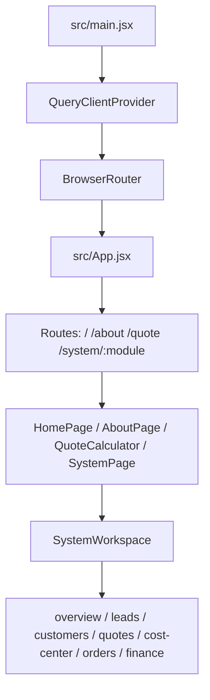

# 项目框架与开发文档

本文档面向开发者，回答三个问题：

1. 这个项目现在到底是什么
2. 代码是怎么组织的
3. 日常开发应该从哪里下手

## 1. 项目定位

这个仓库已经不是单纯 landing page，而是一个物流业务系统 MVP，包含两层产品：

- 官网层：展示品牌、服务能力和公开询价入口
- 系统层：承接线索、客户、报价、订单、财务的内部工作台

当前工程特点：

- 前端框架：`Vite + React 18`
- UI：`Tailwind CSS`
- 数据请求与缓存：`@tanstack/react-query`
- 路由：`React Router`
- 数据库与认证：`Supabase`
- 兜底模式：未配置 Supabase 时，部分页面可继续以本地 demo/mock 方式运行

## 2. 应用结构

### 2.1 顶层运行结构



### 2.2 当前路由结构

项目已经接入 `React Router`，官网层和系统模块都由 URL 驱动：

- `/`
- `/about`
- `/quote`
- `/system/overview`
- `/system/leads`
- `/system/customers`
- `/system/quotes`
- `/system/cost-center`
- `/system/orders`
- `/system/finance`

这意味着：

- 刷新页面可以保留当前模块
- 浏览器前进/后退可以用于模块切换
- 后续可以继续扩展 `/system/orders/:id`、`/system/customers/:id`、`/system/quotes/:id`
- 模块间草稿状态仍保留在 `SystemWorkspace`，用于承接线索转报价、报价转订单、订单转财务等即时操作
- 移动端不再横排展示全部模块，改用模块选择器，避免业务内容被导航挤占

## 3. 目录结构

当前建议按下面的心智理解仓库：

```text
.
├── docs/                      # 项目文档与交付说明
├── public/                    # 静态资源
├── scripts/                   # 本地检查、Supabase bundle 与部署辅助脚本
├── src/
│   ├── api/                   # 前端数据访问层，统一封装 Supabase / HTTP fallback
│   ├── components/            # 组件
│   │   ├── system/            # 内部系统工作台模块
│   │   └── TMS/               # 报价、CRM、抽屉等业务组件
│   ├── data/                  # 多语言与静态文案
│   ├── hooks/                 # React Query hooks 与认证/业务 hooks
│   ├── lib/                   # Supabase client、QueryClient 等基础库
│   ├── page/                  # 页面级组件
│   ├── store/                 # 本地状态存储
│   ├── system/                # mockData 和系统级演示数据
│   └── types/                 # 共享类型常量或类型辅助
├── supabase/
│   ├── migrations/            # 数据库迁移
│   ├── seed.sql               # 种子数据
│   ├── smoke_test.sql         # SQL smoke test
│   └── deploy_bundle.sql      # 打包后的 SQL bundle
├── README.md                  # 仓库入口文档
├── vite.config.js
└── tailwind.config.js
```

## 4. 前端分层说明

### 4.1 页面层

- `src/App.jsx`
  - 应用总入口
  - 负责语言切换
  - 负责官网层和系统层路由
- `src/page/HomePage.jsx`
  - 官网首页
- `src/page/AboutPage.jsx`
  - 公司/介绍页
- `src/page/SystemPage.jsx`
  - 系统工作台页面壳，实际渲染 `SystemWorkspace`

### 4.2 系统工作台层

`src/components/system/SystemWorkspace.jsx` 是内部系统最重要的容器组件，职责包括：

- 左侧模块导航
- 顶部快捷动作
- 登录/注册面板接入
- 模块间草稿数据传递
- 业务通知展示

当前内置模块：

- `SystemOverview`
- `LeadPoolWorkspace`
- `CustomerWorkspace`
- `QuoteWorkspace`
- `CostCenterWorkspace`
- `OrderWorkspace`
- `FinanceWorkspace`

模块展示由 `/system/:module` 决定，模块间草稿传参仍主要靠：

- `selectedLead`
- `customerDraft`
- `orderDraft`
- `financeDraft`
- `notice`

### 4.3 数据访问层

`src/api/` 是当前工程里最值得保留的结构之一。它做了两件事：

1. 优先走 Supabase 直连
2. 未配置 Supabase 时回退到 `VITE_API_BASE_URL` 指向的 REST 风格接口

核心文件：

- `src/api/http.js`
  - 负责 `fetch` 封装
  - 自动带 `localStorage.access_token`
- `src/api/supabaseAdapter.js`
  - 负责判断是否启用 Supabase
  - 提供分页、RPC、统一成功返回格式
- `src/api/leads.js`
- `src/api/customers.js`
- `src/api/quotes.js`
- `src/api/orders.js`
- `src/api/finance.js`
- `src/api/dashboard.js`

这层的意义是：页面和 hooks 不直接依赖数据库细节，后续如果要引入 Edge Functions 或自建后端，也可以在 `api/` 层逐步替换。

### 4.4 Hook 层

`src/hooks/` 主要负责把 API 接到 React Query：

- 查询 key：`src/hooks/queryKeys.js`
- 业务 hooks：
  - `useLeads`
  - `useCustomers`
  - `useQuotes`
  - `useOrders`
  - `useFinance`
  - `useDashboard`
  - `usePricing`
  - `useAuthSession`

当前缓存入口在：

- `src/lib/queryClient.js`

默认行为：

- query `retry: 1`
- `refetchOnWindowFocus: false`
- `staleTime: 30s`

## 5. 数据流与运行模式

### 5.1 正常模式

```text
UI 组件
-> hooks
-> src/api/*
-> Supabase table / RPC
```

### 5.2 兜底模式

```text
UI 组件
-> hooks
-> src/api/*
-> HTTP fallback (/api/v1)
或本地草稿 / mock 继续演示
```

注意：

- 并不是所有模块都具备完整 mock 写入能力
- 当前“可演示”不等于“全部真实持久化”
- 真实业务验证仍以 Supabase 环境为准

## 6. 数据库与 Supabase

Supabase 在当前项目中承担四类职责：

- 认证：`auth`
- 主业务表：线索、客户、报价、订单、财务
- RPC：单号生成、线索转客户、报价转订单、自动跟进等
- RLS：按角色控制访问权限

关键目录：

- `supabase/migrations/`
- `supabase/seed.sql`
- `supabase/smoke_test.sql`
- `supabase/deploy_bundle.sql`

关键 RPC：

- `app_next_doc_no`
- `app_convert_lead_to_customer`
- `app_convert_quote_to_order`
- `app_generate_receivable_for_order`
- `app_generate_payables_for_order`
- `app_score_lead`
- `app_schedule_follow_up_for_lead`
- `app_bulk_schedule_lead_followups`

## 7. 本地开发

### 7.1 安装与启动

```bash
npm install
cp .env.example .env
npm run dev
```

默认前端开发命令：

- `npm run dev`
- `npm run build`
- `npm run preview`

### 7.2 环境变量

当前 `.env.example` 中最关键的是：

```env
VITE_SUPABASE_URL=
VITE_SUPABASE_ANON_KEY=
VITE_API_BASE_URL=/api/v1
SUPABASE_PROJECT_REF=
SUPABASE_SMOKE_EMAIL=
SUPABASE_SMOKE_PASSWORD=
```

开发建议：

- 只做纯 UI 调整时，可以暂时不连 Supabase
- 做真实业务联调时，至少配置 `VITE_SUPABASE_URL` 和 `VITE_SUPABASE_ANON_KEY`
- 需要跑登录态 smoke test 时，再补 `SUPABASE_SMOKE_EMAIL` 与 `SUPABASE_SMOKE_PASSWORD`

## 8. 常用检查命令

### 8.1 工程交付检查

```bash
npm run check:delivery
npm run check:delivery:build
```

作用：

- 检查关键文件是否存在
- 检查脚本与依赖是否齐全
- 可选执行生产构建

### 8.2 Supabase 检查

```bash
npm run check:supabase:schema
npm run check:supabase
npm run check:supabase:write
```

作用：

- 校验表结构是否已部署
- 校验匿名读取与登录后 RPC 访问
- 可选验证匿名写入线索权限

### 8.3 SQL bundle

```bash
npm run build:supabase:sql
npm run deploy:supabase:build
npm run deploy:supabase
npm run deploy:supabase:dry-run
npm run deploy:supabase:verify
```

适用场景：

- 需要把多份 migration 合并成 SQL Editor 可执行 bundle
- 需要在部署前做 dry run 或验收

## 9. 推荐开发流程

### 9.1 纯前端改动

1. 从 `src/page` 或 `src/components` 找到入口组件
2. 确认对应 URL 路由或系统模块路径
3. 修改 UI
4. 跑 `npm run build`

### 9.2 新增一个业务模块

建议按下面顺序做：

1. 在 `src/components/system/` 新建工作台模块组件
2. 在 `SystemWorkspace.jsx` 接入导航、路径和渲染
3. 在 `src/api/` 新增对应数据访问文件
4. 在 `src/hooks/` 新增 React Query hook
5. 如果涉及真实写库，再补 Supabase migration / RPC / RLS
6. 更新 `README.md` 和相关 `docs/`

### 9.3 改造现有业务流

如果你要改“线索 -> 报价 -> 订单 -> 财务”链路，优先检查：

- 草稿对象是否在模块切换时被正确传递
- `api` 层是否已有 Supabase 直连逻辑
- 是否依赖 RPC
- 是否需要同步更新 `seed.sql` / `smoke_test.sql`

## 10. 当前架构优点与限制

### 10.1 优点

- 结构已经从 demo 页面升级成“官网 + 系统工作台”双层产品
- `api + hooks + supabaseAdapter` 分层基本清晰
- Supabase migration、seed、smoke test、delivery check 已成体系
- 能在未接通数据库时继续做 UI 与流程演示

### 10.2 限制

- 客户、报价、订单详情已支持 `/system/customers/:id`、`/system/quotes/:id`、`/system/orders/:id` 深链和复制详情链接；后续仍可继续拆成更独立的详情页组件
- 缺少自动化测试
- 驾驶舱基础指标已接入 RPC 汇总，但仍需要继续补趋势图、角色化 KPI 和异常钻取
- 部分业务流还依赖本地草稿态
- 生产级权限、审批、审计和文件存储还需要继续补

## 11. 后续建议

优先级建议如下：

1. 拆出订单、客户、报价详情页组件，继续增强 URL 直达后的空状态、权限提示和详情骨架
2. 为核心链路补自动化测试：线索、报价、订单、财务
3. 将高风险业务规则逐步从浏览器迁移到 RPC 或 Edge Functions
4. 增加统一文档规范，功能变更时同步维护 `README` 和 `docs`

## 12. 配套阅读顺序

建议新同学按下面顺序阅读：

1. `README.md`
2. `docs/PROJECT_FRAMEWORK_AND_DEVELOPMENT.md`
3. `docs/SYSTEM_ARCHITECTURE.md`
4. `docs/CURRENT_FRAMEWORK_AND_FLOW.md`
5. `docs/OPTIMIZATION_ROADMAP.md`
6. `supabase/README.md`
