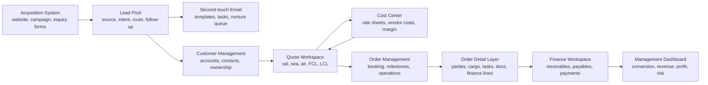
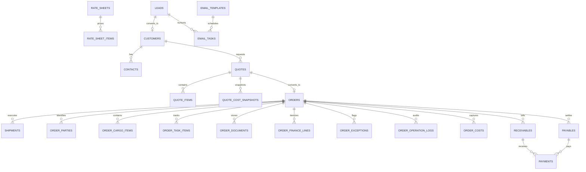

# System Architecture

This document describes the MVP operating architecture for the logistics system covering acquisition, CRM, quotation, order execution, cost center, and finance settlement.

## Functional Modules

## Core Business Flow

1. Acquisition sources capture lead data from website forms, campaigns, direct inquiry, and manual sales entry.
2. Lead Pool stores source, contact, route, cargo, transport mode interest, and intent level.
3. Lead scoring calculates priority, intent, scoring reasons, and next-best-action from shipment readiness and buying signals.
4. Second-touch email tasks can follow up cold or warm leads with reusable templates and scheduled priority.
5. Qualified leads convert to customer and contact records.
6. Quote Workspace creates route-based quotes for rail, sea, air, FCL, LCL, customs, and delivery services.
7. Cost Center provides base cost, supplier cost, and margin inputs for automatic quote calculation.
8. Accepted quotes convert into orders.
9. Orders initialize operational detail records for parties, cargo, service segments, tasks, documents, finance lines, exceptions, and logs.
10. Orders generate receivables and payables for finance tracking.
11. Finance records collections, supplier payments, balances, and profit.

## Cost Center And Auto Quotation

The cost center is designed to support quotation automation through:

- rate sheets by mode, lane, currency, effective date, and vendor
- rate line items by fee code, unit, revenue price, cost price, and minimum charge
- quote item snapshots so historical quotes do not change when rate sheets update
- estimated revenue, cost, profit, and margin calculations during quote creation
- payables generation from accepted quote cost snapshots after order conversion

Current MVP support:

- Supabase tables for `rate_sheets`, `rate_sheet_items`, `quote_items`, `quote_cost_snapshots`, `order_costs`, and `payables`
- seed rate data for rail, sea, and air
- frontend fallback calculation for demo mode
- quote-to-order and order-to-finance RPC workflows

Recommended next production step:

- move pricing rules into a controlled RPC or Edge Function so margin rules, approval limits, and vendor selection are not exposed in the browser

## Acquisition Automation

The acquisition module is designed to increase lead conversion speed:

- lead score combines contact completeness, route readiness, cargo size, source quality, shipment type, and buying-signal keywords
- next-best-action tells sales whether to call immediately, send a route proposal, or enter nurture
- follow-up RPCs create email tasks with template snapshots so later template edits do not change already queued outreach
- bulk scheduling prevents hot inbound leads from sitting without a second touch

## Finance Form Coverage

The current database design covers the main financial forms needed after order creation:

- customer receivable generated from accepted quote revenue
- supplier payable generated from order cost lines
- payment records for receipts and supplier payments
- balance tracking on receivables and payables
- currency fields for quote, cost, receivable, payable, and payment records
- FX rate table for later cross-currency accounting
- editable order finance lines for fee item, party, unit price, quantity, FX rate, tax rate, bill number, invoice number, and external accounting push status

Items to finalize with finance before production:

- invoice number format
- tax/VAT rules
- settlement currency policy
- due date policy
- write-off and adjustment workflow
- accounting export format
- approval workflow for cost changes after quote acceptance

## Data Domains

## Roles

Authorization roles are read from Supabase app metadata, not user metadata.

- `marketing`: acquisition, lead source, campaign, email tasks
- `sales`: lead qualification, customer conversion, quote drafts
- `ops`: order execution, milestones, supplier cost capture
- `finance`: receivables, payables, payment registration
- `manager`: dashboards, approvals, exception review
- `admin`: role assignment, master data, system configuration

## Delivery Boundary

The MVP is ready as an operating shell and Supabase-backed workflow prototype. For production hardening, prioritize controlled backend workflows for pricing, finance posting, audit logging, and role administration.
